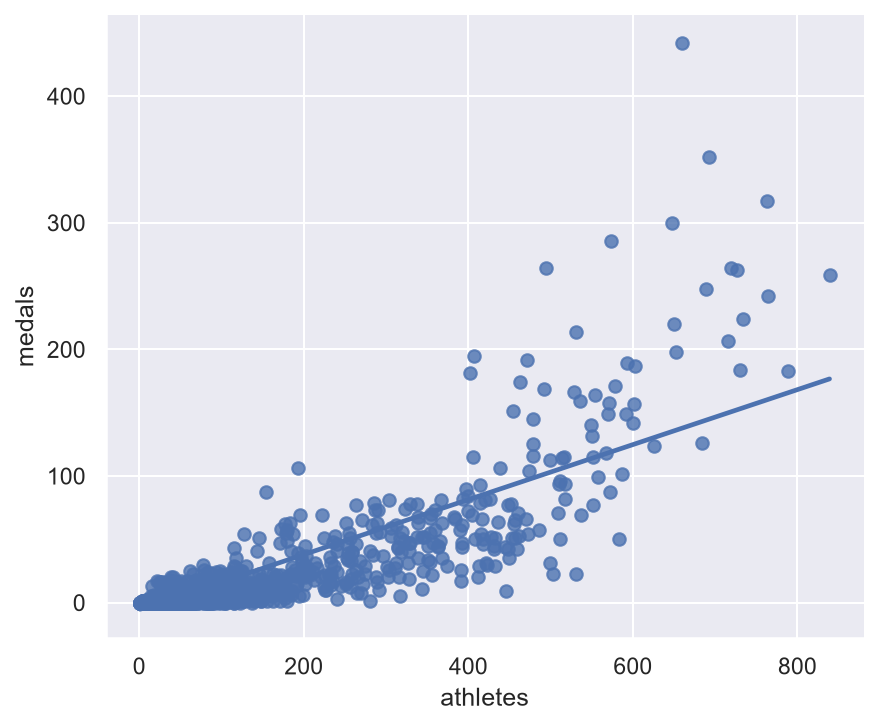
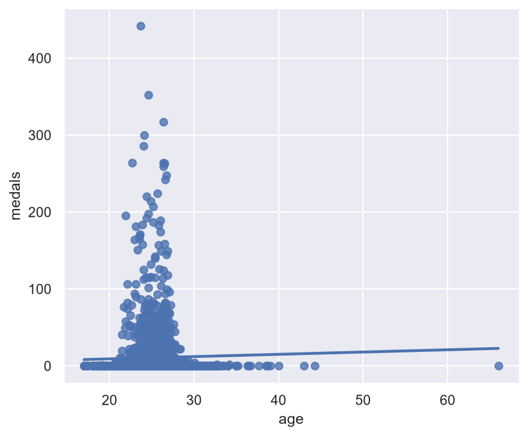
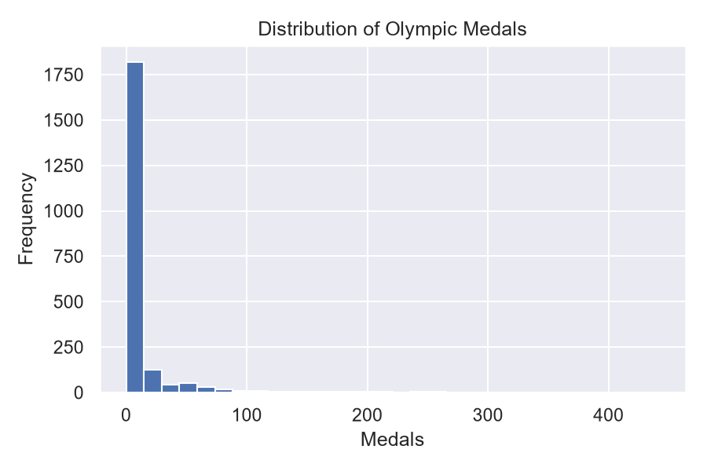
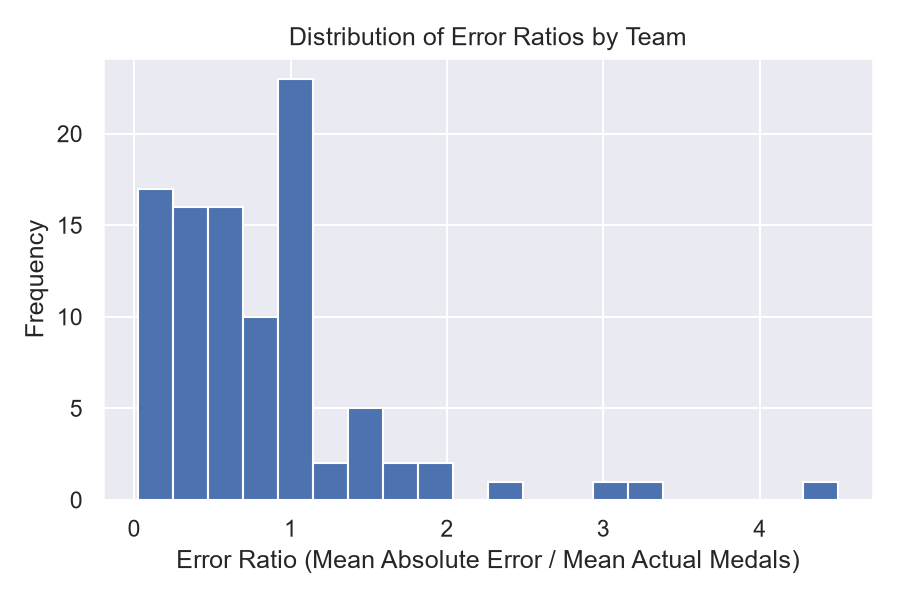

# Olympic Medals Prediction using Linear Regression

[](https://www.python.org/)
[](https://scikit-learn.org/)
[]()

An end-to-end Machine Learning project to predict the number of Olympic medals a country will win in future Olympics based on historically relevant features: **team size (number of competing athletes)** and **historical performance (medals won in the previous Olympics)**.

This repository contains a full Jupyter Notebook pipeline, structured dataset preprocessing, evaluation metrics, and comparative analyses between predicted and actual medal tallies for multiple countries.

## Repository Structure

```
├── Linear Regression.ipynb  # Primary Jupyter Notebook containing the development code
├── teams.csv                # Raw historical dataset containing Olympic statistics (1964-2016)
├── run_analysis.py          # Python automation script for training, evaluating, and plotting
├── README.md                # Professional project documentation (this file)
├── athletes_vs_medals.png   # Scatter plot of athletes count vs medals won
├── age_vs_medals.png        # Scatter plot of average team age vs medals won
├── medals_histogram.png     # Distribution histogram of medals
└── error_ratio_histogram.png# Distribution of prediction error ratios by country
```

---

## Deep Scan: Analysis & Data Insights

### 1. Data Dictionary

The teams.csv dataset contains **2,144 rows** and **11 columns** of historical Olympic records for various nations. The columns include:
*   `team` / `country`: Country identifier code and name.
*   `year`: The year of the Olympic Games (ranging from 1964 to 2016).
*   `athletes`: Number of competing athletes sent by the country.
*   `age` / `height` / `weight`: Demographic averages of the country's team.
*   `medals`: Total medals won in that year (Target Variable).
*   `prev_medals`: Medals won by the country in the previous Olympic Games (Predictor Variable).
*   `prev_3_medals`: Average medals won by the country in the previous 3 Olympic Games.

### 2. Feature Correlation

We computed the linear correlation of numeric features against the target variable (`medals`):

| Feature | Correlation with `medals` | Impact & Insights |
| :--- | :--- | :--- |
| **`prev_medals`** | **`0.920048`** | **Extremely Strong positive correlation.** The strongest predictor of future success is past performance. |
| **`athletes`** | **`0.840817`** | **Strong positive correlation.** Sending more athletes increases probability of winning medals. |
| `age` | `0.025096` | Virtually no correlation. Average age does not impact total medal count. |
| `year` | `-0.021603` | No correlation. Total medals won do not change linearly over time. |

*Selected Predictors:* `["athletes", "prev_medals"]`

---

## Data Preprocessing & Modeling Pipeline

The project development pipeline, outlined in Linear Regression.ipynb, proceeds as follows:

### 1. Data Cleaning
*   **Missing Values:** The feature `prev_medals` had 130 null values (representing countries participating for the first time in the current dataset history). These rows were removed, reducing the dataset size to **2,014 records**.

### 2. Train-Test Split (Avoiding Lookahead Bias)
Because Olympic data is time-series in nature, a random split would cause future data to leak into training.
*   **Training Set:** Olympic Games **before 2012** (1,609 records).
*   **Testing Set:** Olympic Games **2012 and 2016** (405 records).

### 3. Model Training
*   **Algorithm:** Ordinary Least Squares Linear Regression (`sklearn.linear_model.LinearRegression`).
*   **Model Equation:**
    $$\text{Predicted Medals} = w_1 \times \text{athletes} + w_2 \times \text{prev\_medals} + b$$

### 4. Prediction Post-Processing
*   **Negative Boundary Check:** Linear regression models can output negative medal counts. The pipeline clamps all negative predictions to `0`:
    ```python
    test.loc[test["predictions"] < 0, "predictions"] = 0
    ```
*   **Integer Rounding:** Since medals are discrete counts, predictions are rounded to the nearest integer:
    ```python
    test["predictions"] = test["predictions"].round()
    ```

---

## Visualizations & Plot Analyses

### Plot 1: Athletes Count vs. Medals Won
There is a clear positive linear trend showing that countries that field larger athletic squads consistently bring home more medals.



### Plot 2: Average Age vs. Medals Won
The flat regression line demonstrates that the average age of a country's athletic delegation has no direct linear relationship with the number of medals won.



### Plot 3: Distribution of Medals
The histogram shows a highly right-skewed distribution. The vast majority of countries win 0 to 5 medals, while a small group of powerhouse nations wins over 100 medals.



### Plot 4: Prediction Error Ratios by Team
The error ratio (calculated as $\frac{\text{Mean Absolute Error}}{\text{Mean Medals Won}}$) varies. For elite nations, predictions are highly accurate (error ratio < 0.2). For smaller nations, the ratio is wider because a small absolute error represents a large percentage of their low medal counts.



---

## Model Performance & Evaluation

The trained Linear Regression model was evaluated on the test set (2012 & 2016 Olympics) with the following results:

*   **Mean Absolute Error (MAE):** `3.2988`
*   **Standard Deviation of Medals:** `28.8203`
*   **Mean Medals in Test Set:** `9.7852`

> [!NOTE]
> The model's MAE of `3.29` is significantly lower than the standard deviation of `28.82`, showing that the model is performing quite well overall.

### Country-Specific Predictions

#### United States (USA)
Highly accurate predictions since the USA has consistent performance and a large delegation.
*   **2012:** Competing Athletes: `689` | Previous Medals: `317.0` | **Actual: 248** | **Predicted: 285** (Error: `+37`)
*   **2016:** Competing Athletes: `719` | Previous Medals: `248.0` | **Actual: 264** | **Predicted: 236** (Error: `-28`)

#### India (IND)
Good performance tracking, with a slight overestimate in 2016 due to an increased athlete delegation size (130) compared to previous historical conversion rates.
*   **2012:** Competing Athletes: `95` | Previous Medals: `3.0` | **Actual: 6** | **Predicted: 7** (Error: `+1`)
*   **2016:** Competing Athletes: `130` | Previous Medals: `6.0` | **Actual: 2** | **Predicted: 12** (Error: `+10`)

### Error Ratio Breakdown
The error ratio represents the average deviation of predictions relative to the country's average medal wins:

$$\text{Error Ratio} = \frac{\text{Average Absolute Prediction Error}}{\text{Average Actual Medals}}$$

#### Top 10 Most Accurately Predicted Teams (Lowest Error Ratios)
1.  **France (FRA):** `0.0225` (2.2% average error)
2.  **Canada (CAN):** `0.0484` (4.8% average error)
3.  **New Zealand (NZL):** `0.0635` (6.3% average error)
4.  **Russia (RUS):** `0.0824`
5.  **Italy (ITA):** `0.1214`
6.  **Kenya (KEN):** `0.1250`
7.  **United States (USA):** `0.1270`
8.  **Great Britain (GBR):** `0.1328`
9.  **Czech Republic (CZE):** `0.1379`
10. **Norway (NOR):** `0.1389`

#### Teams with Highest Error Ratios
Teams like **Austria (AUT - 4.5)**, **Portugal (POR - 3.3)**, and **Hong Kong (HKG - 3.0)** have high error ratios. This is because these countries win very few medals on average (e.g. 1 or 2), so a prediction error of just 3 or 4 medals inflates the ratio significantly.

---

## How to Run the Project

1.  Clone the repository:
    ```bash
    git clone https://github.com/sidrahwaghoo/Olympic-Medal-Prediction-using-Linear-Regression
    cd Olympic-Medal-Prediction-using-Linear-Regression
    ```
2.  Install dependencies:
    ```bash
    pip install pandas numpy scikit-learn seaborn matplotlib
    ```
3.  Execute the automated python runner to train the model, inspect results, and generate the assets:
    ```bash
    python run_analysis.py
    ```

---

## Version History & Git Tagging

This repository uses standard git version tags to mark milestones:
*   **v1.0.0:** Baseline model using Scikit-Learn Linear Regression with features `["athletes", "prev_medals"]`.
*   **Description:** Model achieves an MAE of `3.29` on the 2012/2016 Olympics test sets.
